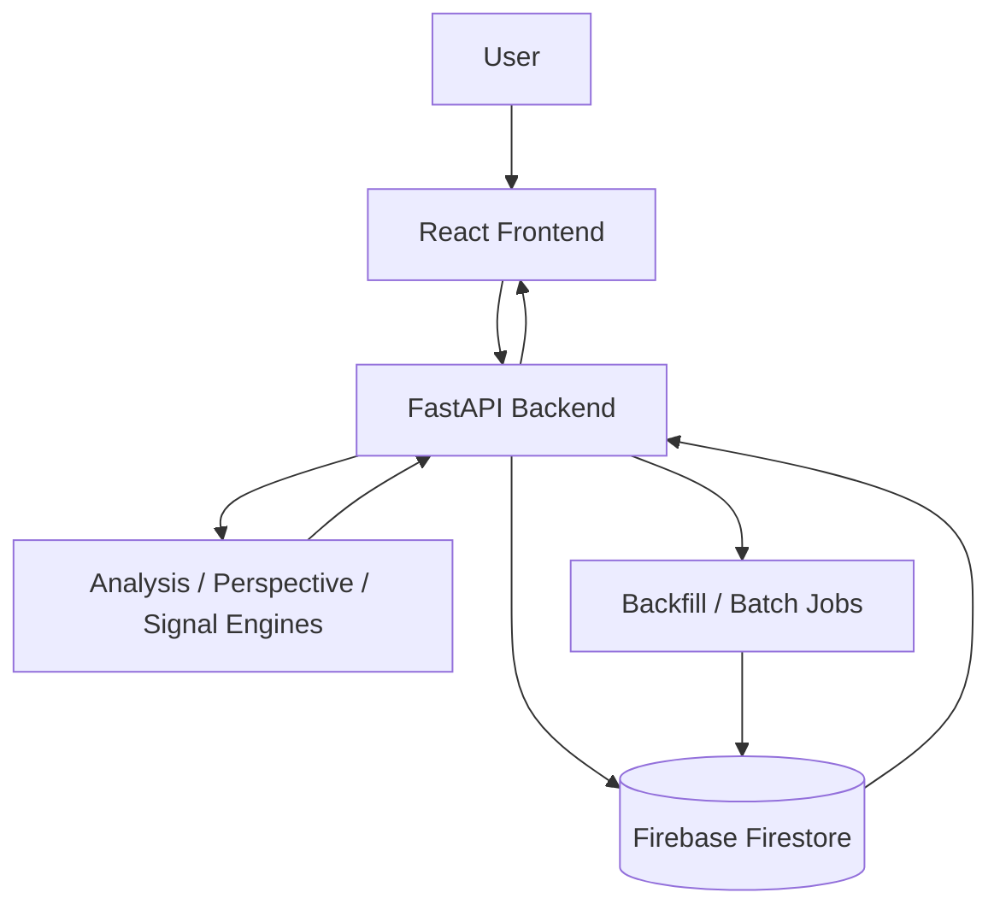

# Agent Handover

This repository is a Taiwan stock decision dashboard.

Use this file as the first stop for agent work. Each deeper topic has its own focused document:

- [Frontend Architecture](FRONTEND_ARCHITECTURE.md)
- [Backend Architecture](BACKEND_ARCHITECTURE.md)
- [Firebase Schema](FIREBASE_SCHEMA.md)
- [Business Rule Engine](BUSINESS_RULE_ENGINE.md)
- [Deploy Guide](DEPLOY_GUIDE.md)
- [API Reference](API_REFERENCE.md)

## Current Runtime

| Area | Stack | Entry |
|---|---|---|
| Frontend | React + Vite | `src/main.jsx`, `src/App.jsx` |
| Charting | `lightweight-charts` | `src/App.jsx` |
| Backend | FastAPI | `backend/main.py` |
| Data store | Firebase Firestore | `backend/firebase.py`, `backend/firebase_cache.py` |
| Batch tools | React UI + FastAPI jobs | `src/BatchPage.jsx`, `backend/jobs.py`, `backend/chip_routes.py` |
| Deploy | Render | `render.yaml` |

## Production URLs

Known URLs from the existing documentation:

- Frontend: `https://stock-analysis-ya45.onrender.com`
- API: `https://stock-analysis-api-ihun.onrender.com`
- Repository: `spinyang0805/Stock-analysis-`

Note: `render.yaml` currently contains `VITE_API_BASE_URL=https://stock-analysis-api.onrender.com`, while `src/App.jsx` hard-falls back to `https://stock-analysis-api-ihun.onrender.com`. Check this before changing deployment behavior.

## High-Level Flow

## Agent Reading Order

1. Read this handover.
2. Read the doc matching the area you will touch.
3. For API changes, also read `docs/API_REFERENCE.md`.
4. For Firestore writes, also read `docs/FIREBASE_SCHEMA.md`.
5. For scoring, cards, alerts, or trade output, also read `docs/BUSINESS_RULE_ENGINE.md`.

## Important Working Rules

- Keep frontend API response parsing defensive. Existing UI accepts multiple payload shapes.
- Batch APIs should expose `offset`, `limit`, `next_offset`, `error_count`, and `errors`.
- Route order matters for chip endpoints: `/api/chip/backfill_all` must be registered before `/api/chip/{stock}`.
- Bump visible frontend version labels when making user-visible frontend changes.
- Do not assume generated chip seed data is real TWSE/TPEX institutional data.
- Keep JSON responses UTF-8 and include `status` where possible.

## Known Code Areas

| Task | Files |
|---|---|
| Main dashboard UI | `src/App.jsx` |
| Batch / universe / chip tooling UI | `src/BatchPage.jsx` |
| System control panel | `src/SystemControlPanel.jsx` |
| Main API routes | `backend/main.py` |
| Chip APIs | `backend/chip_routes.py` |
| Firestore cache helpers | `backend/firebase_cache.py` |
| Daily and backfill jobs | `backend/jobs.py` |
| Product universe | `backend/stock_list.py`, `backend/maintenance_routes.py` |
| Rule-based analysis | `backend/analysis_engine.py` |
| Perspective cards | `backend/perspective_engine.py` |
| Signals, trade plan, backtest | `backend/signal_engine.py` |

## Current Follow-Up Ideas

- Replace generated chip seed rows with real TWSE/TPEX institutional and margin sources.
- Integrate chip score into the main decision score more explicitly.
- Add a full health endpoint that checks API, Firebase, product universe, stock data, and chip data.
- Review duplicated queue/backfill route installation code across `queue_api.py`, `auto_routes.py`, and `sitecustomize.py`.
