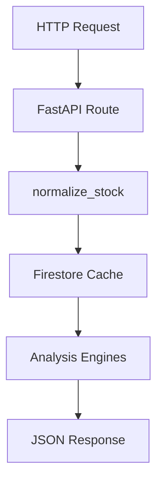

# Backend Architecture

The backend is a FastAPI service that reads/writes Firestore, fetches Taiwan market data, runs analysis rules, and exposes dashboard APIs.

## Entry Point

Main app:

```text
backend/main.py
```

FastAPI setup includes CORS allowing all origins.

```python
app = FastAPI(title="TW Stock Decision API")
```

## Module Map

| File | Responsibility |
|---|---|
| `main.py` | Main API routes, stock normalization, kline/analysis/dashboard/backtest endpoints |
| `firebase.py` | Firebase initialization and exported `db` |
| `firebase_cache.py` | Firestore cache read/write/audit/cleanup helpers |
| `jobs.py` | TWSE/TPEX fetching, daily update, historical backfill, preload jobs |
| `stock_list.py` | Product universe from Firebase and external sources |
| `analysis_engine.py` | Technical indicators and rule-based score |
| `perspective_engine.py` | UI-facing perspective cards |
| `signal_engine.py` | Signals, trade plan, backtest |
| `dashboard_service.py` | Realtime board/institutional/margin dashboard helpers |
| `chip_routes.py` | Chip init/read/backfill routes and chip scoring |
| `maintenance_routes.py` | Universe init, fast products, rebuild/reset helpers |
| `queue_api.py` | Queue-style backfill job APIs |
| `auto_routes.py` | Auto backfill/status/screener routes |
| `sitecustomize.py` | Runtime route patching/installation helpers |

## Main Request Flow



For kline and analysis routes, if Firestore lacks enough rows, the backend can start a background backfill and return a loading-style response.

## Stock Normalization

`main.py` normalizes stock input:

```python
def normalize_stock(stock: str) -> str:
    stock = str(stock).strip()
    mapped = STOCK_NAME_MAP.get(stock, stock)
    return str(mapped).upper().replace(".TW", "").replace(".TWO", "").split()[0]
```

Examples:

| Input | Output |
|---|---|
| `2330.TW` | `2330` |
| `2330.TWO` | `2330` |
| `00981A` | `00981A` |

Name aliases are handled through `STOCK_NAME_MAP`.

## Main API Groups

See [API Reference](API_REFERENCE.md) for details.

| Group | Routes |
|---|---|
| Health | `/` |
| Products | `/api/search`, `/api/products`, `/api/products_fast` |
| Firebase maintenance | `/api/firebase/test`, `/api/firebase/audit_all`, `/api/firebase/cleanup_all`, `/api/firebase/reset_all`, `/api/firebase/cleanup/{stock}` |
| Jobs | `/api/job/daily`, `/api/job/preload`, `/api/job/backfill/{stock}`, `/api/job/backfill_all`, `/api/job/backfill_all_auto`, `/api/job/status/{job_id}` |
| Cache | `/api/cache/status/{stock}` |
| Dashboard data | `/api/kline/{stock}`, `/api/analysis/{stock}`, `/api/dashboard/{stock}`, `/api/backtest/{stock}` |
| Chip | `/api/chip/backfill_all`, `/api/chip/init/{stock}`, `/api/chip/{stock}` |
| Universe maintenance | `/api/init_universe`, `/api/init_universe_batch` |

## Kline Endpoint

```http
GET /api/kline/{stock}
```

Responsibilities:

- Normalize stock input.
- Read valid `stock_daily/{stock}/data` rows.
- Convert rows to a DataFrame.
- Enrich indicators.
- Return kline rows and metadata.
- Start backfill when data is missing or insufficient.

Important response fields:

- `status`
- `stock`
- `normalized_stock`
- `meta`
- `data`
- `cache_rows`
- `data_requirement`

## Analysis Endpoint

```http
GET /api/analysis/{stock}
```

Responsibilities:

- Read enough historical rows.
- Run `build_rule_based_analysis`.
- Generate perspective cards.
- Generate signals.
- Generate trade plan.
- Write/update `analysis_cache/{stock}` when appropriate.

## Dashboard Endpoint

```http
GET /api/dashboard/{stock}
```

Combines:

- `basic`
- `kline`
- `analysis`
- `dashboard`
- `chip`
- `source`

## Backtest Endpoint

```http
GET /api/backtest/{stock}
```

Runs the signal engine backtest over kline rows.

## Chip Routes

Route order matters:

```text
/api/chip/backfill_all
/api/chip/init/{stock}
/api/chip/{stock}
```

`/api/chip/backfill_all` must be registered before `/api/chip/{stock}` so FastAPI does not treat `backfill_all` as a stock id.

Chip routes write to:

- `chip_daily`
- `chip_analysis`

## Background Work

The backend uses background threads for some jobs:

- Daily update.
- Preload hot stocks.
- Single stock backfill.
- Batch backfill.
- Queue/rebuild jobs.

Agent notes:

- Keep long-running operations resumable.
- Prefer small batch limits on free Render instances.
- Store progress in `job_logs` or `job_queue`.
- Include `error_count` and `errors` in batch responses.

## Backend Change Checklist

- Keep JSON response fields backward compatible.
- Keep route specificity before path variables.
- Validate Firestore writes against [Firebase Schema](FIREBASE_SCHEMA.md).
- Update [API Reference](API_REFERENCE.md) when adding or changing endpoints.
- Update [Business Rule Engine](BUSINESS_RULE_ENGINE.md) when changing score/card/signal logic.
- Run a backend import/build check before handoff.
