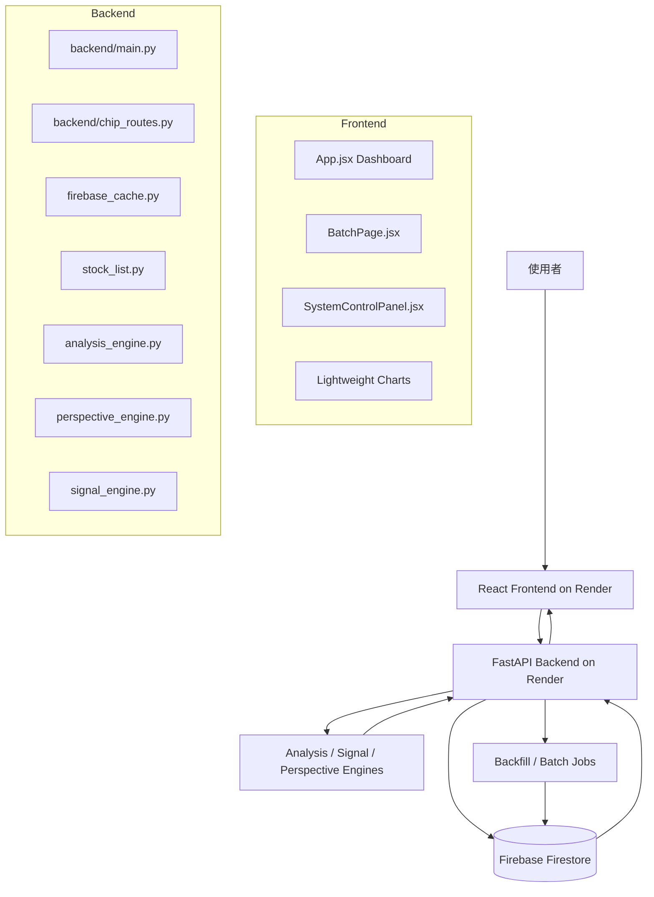
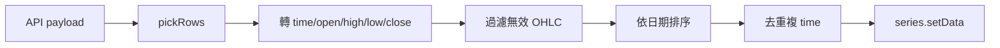
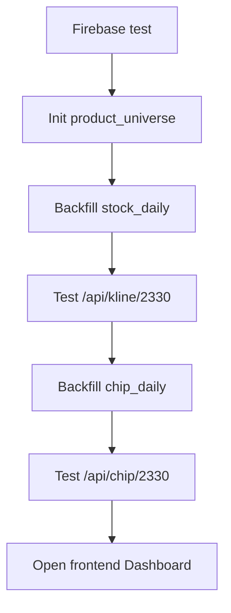

# 台股分析網站規劃設計書

> 給程式設計師、維運人員與 AI Agent 使用。  
> 前端：https://stock-analysis-ya45.onrender.com  
> 後端：https://stock-analysis-api-ihun.onrender.com  
> Repo：spinyang0805/Stock-analysis-  
> 前端主版：TW STOCK DECISION SYSTEM v16  
> 批次工具版：batch-v2-chip  
> 更新日期：2026-05-14

---

## 1. 系統定位

本系統是台股分析與資料維護網站，包含股票/ETF/債券ETF商品清單、歷史日線、K線圖、技術指標、Decision Score、籌碼面分析、批次資料更新與 Firebase Firestore 資料管理。

系統主要解決：

1. 股票資料可以從後端統一查詢與回補。
2. Firestore 作為快取資料庫，前端不直接寫資料庫。
3. 前端可以用按鈕方式分批更新資料，不需要手機複製 offset 網址。
4. 所有批次 API 必須回傳 `next_offset`，讓前端可以自動跳下一批。
5. 籌碼判斷不可只看單日買超，要看近 5 日、近 10 日、連買連賣與信用交易。

---

## 2. 技術架構

| 類別 | 技術/服務 | 說明 |
|---|---|---|
| 前端 | React + Vite | Dashboard 與 Batch Tool |
| 圖表 | lightweight-charts | K線、成交量、RSI、MACD、MA、布林 |
| 後端 | FastAPI / Python | 提供 API、回補、分析、批次任務 |
| 資料庫 | Firebase Firestore | 儲存 stock_daily、chip_daily、analysis_cache 等 |
| 前端部署 | Render Static Site | https://stock-analysis-ya45.onrender.com |
| 後端部署 | Render Web Service | https://stock-analysis-api-ihun.onrender.com |
| 版本控管 | GitHub | spinyang0805/Stock-analysis- |

---

## 3. 系統架構圖



---

## 4. 前端設計

### 4.1 主要檔案

| 檔案 | 用途 |
|---|---|
| `src/main.jsx` | React 掛載入口，掛載 App、BatchPage、SystemControlPanel |
| `src/App.jsx` | 股票 Dashboard、搜尋、K線、指標、Decision Score |
| `src/BatchPage.jsx` | 批次工具，Universe 初始化與 chip_daily 批次更新 |
| `src/SystemControlPanel.jsx` | 資料維護控制台，清空/回補/測試等工具 |

### 4.2 Dashboard 功能

`App.jsx` 負責：

1. 顯示版本：`TW STOCK DECISION SYSTEM v16`。
2. 顯示 API Base URL。
3. 股票搜尋與代號解析。
4. 呼叫 `/api/kline/{stock}`。
5. 呼叫 `/api/analysis/{stock}`。
6. 將 API K線資料 normalize 成 lightweight-charts 可用格式。
7. 顯示 K線、成交量、RSI、KD、MA、布林。
8. 顯示資料狀態、Decision Score、技術指標。

### 4.3 前端版本規則

每次修改前端必須更新：

```js
const APP_VERSION = "v16";
const BUILD_LABEL = "2026-05-14 21:45";
const COMMIT_LABEL = "multi-kline-schema";
```

使用者用手機測試時只要看頁面最上方版本即可確認是否部署成功。

### 4.4 前端 API Base

目前固定：

```js
const DEFAULT_API = "https://stock-analysis-api-ihun.onrender.com";
const RAW_API = import.meta.env.VITE_API_BASE_URL || DEFAULT_API;
const API = String(RAW_API).includes("stock-analysis-api-ihun")
  ? String(RAW_API).replace(/\/$/, "")
  : DEFAULT_API;
```

設計原因：避免 Render 環境變數誤設成前端網址。

---

## 5. 前端 K線資料邏輯

### 5.1 支援的 API 回傳格式

前端 `pickRows(payload)` 支援：

```text
payload.data
payload.rows
payload.items
payload.kline
payload.kline_data
payload.daily
payload.result.data
payload.result.rows
payload.basic.data
```

### 5.2 欄位別名

| 標準欄位 | 可接受別名 |
|---|---|
| open | open, Open, o |
| high | high, High, h |
| low | low, Low, l |
| close | close, Close, c |
| volume | volume, Volume, vol |
| date | date, Date, data_date |
| time | time, timestamp |

### 5.3 正規化流程



### 5.4 Chart 格式

K線：

```json
{"time":"2026-05-05","open":2250,"high":2270,"low":2240,"close":2250}
```

成交量：

```json
{"time":"2026-05-05","value":24233983,"color":"rgba(34,197,94,.55)"}
```

均線：

```json
{"time":"2026-05-05","value":2214}
```

---

## 6. Batch Tool 設計

### 6.1 檔案與版本

檔案：`src/BatchPage.jsx`  
版本：`batch-v2-chip`

### 6.2 Universe 初始化

用途：建立 `product_universe`。

API：

```text
GET /api/init_universe
GET /api/init_universe_batch?offset=0&limit=10
```

前端行為：

1. 使用者按 `Run current`。
2. 呼叫目前 offset/limit。
3. 若 response 有 `next_offset`，自動 setOffset。
4. 若 `next_offset === null`，按鈕變 Done。

### 6.3 籌碼資料批次更新

API：

```text
GET /api/chip/backfill_all?product_type=all&market=上市&offset=0&limit=100&days=20
```

前端控制：

| 控制 | 預設 | 說明 |
|---|---:|---|
| Market | 上市 | 上市 / 上櫃 / all |
| Type | all | all / 股票 / ETF / 債券ETF |
| Offset | 0 | 批次起點 |
| Limit | 100 | 每批筆數 |
| Run chip offset=x | - | 執行目前批次 |
| Reset | - | 重設狀態 |

成功回應必須包含：

```json
{
  "status":"ok",
  "route":"/api/chip/backfill_all",
  "collection":"chip_daily",
  "analysis_collection":"chip_analysis",
  "universe_count":887,
  "offset":0,
  "limit":100,
  "processed":100,
  "written_stocks":100,
  "error_count":0,
  "errors":[],
  "next_offset":100
}
```

若 `next_offset` 是數字，前端跳下一批；若是 `null`，表示完成。

---

## 7. 後端設計

### 7.1 主要檔案

| 檔案 | 用途 |
|---|---|
| `backend/main.py` | FastAPI 主入口、K線、分析、dashboard、backtest、firebase 維護 API |
| `backend/chip_routes.py` | 籌碼初始化、讀取、批次更新 API |
| `backend/firebase.py` | Firebase 初始化 |
| `backend/firebase_cache.py` | stock_daily 快取讀取、清理、驗證 |
| `backend/jobs.py` | daily update、backfill job |
| `backend/stock_list.py` | product universe 與搜尋 |
| `backend/analysis_engine.py` | rule based analysis |
| `backend/perspective_engine.py` | 趨勢/量價/籌碼/信用/風險卡片 |
| `backend/signal_engine.py` | 訊號、交易計畫、回測 |

### 7.2 FastAPI 基本設定

```python
app = FastAPI(title="TW Stock Decision API")
app.add_middleware(
    CORSMiddleware,
    allow_origins=["*"],
    allow_methods=["*"],
    allow_headers=["*"],
)
```

### 7.3 股票代號正規化

```python
def normalize_stock(stock: str) -> str:
    stock = str(stock).strip()
    mapped = STOCK_NAME_MAP.get(stock, stock)
    return str(mapped).upper().replace(".TW", "").replace(".TWO", "").split()[0]
```

例：

| 輸入 | 輸出 |
|---|---|
| 台積電 | 2330 |
| 緯創 | 3231 |
| 2330.TW | 2330 |
| 00981A | 00981A |

---

## 8. Firestore Schema

Firestore 沒有傳統 SQL table，第一次寫入 collection/document 時自動建立。

### 8.1 Collections

| Collection | 用途 |
|---|---|
| stock_daily | 股票/ETF 日線 |
| analysis_cache | 分析快取 |
| job_logs | 工作紀錄 |
| job_queue | 工作隊列 |
| product_universe | 商品清單 |
| system_health | Firebase 健康測試 |
| chip_daily | 籌碼日資料 |
| chip_analysis | 籌碼分析快取 |

### 8.2 stock_daily

路徑：

```text
stock_daily/{stock_id}/data/{yyyymmdd}
```

欄位：

```json
{
  "date":"20260505",
  "data_date":"20260505",
  "open":2250.0,
  "high":2270.0,
  "low":2240.0,
  "close":2250.0,
  "volume":24233983.0,
  "market":"TWSE",
  "name":"台積電",
  "source":"TWSE STOCK_DAY"
}
```

### 8.3 product_universe

路徑：

```text
product_universe/{code}
```

欄位：

```json
{"code":"2330","name":"台積電","market":"上市","type":"股票","industry":"半導體"}
```

### 8.4 analysis_cache

路徑：

```text
analysis_cache/{stock_id}
```

欄位：

```json
{
  "stock_id":"2330",
  "latest_date":"20260505",
  "updated_at":"2026-05-14T12:00:00",
  "perspective_cards":[],
  "signals":{},
  "trade_plan":{},
  "data_rows":225
}
```

### 8.5 chip_daily

路徑：

```text
chip_daily/{stock_id}
chip_daily/{stock_id}/data/{yyyymmdd}
```

父文件：

```json
{
  "stock_id":"2330",
  "latest":{},
  "analysis":{},
  "updated_at":"2026-05-14T12:00:00"
}
```

子文件：

```json
{
  "date":"20260514",
  "foreign_buy":12000,
  "investment_trust_buy":2300,
  "dealer_buy":-500,
  "margin_balance":10000,
  "short_balance":2500,
  "source":"generated_seed_v1"
}
```

重要限制：目前 `chip_daily` 使用 `generated_seed_v1` seed data，先讓 schema/API/UI 跑通，正式版要改成真實 TWSE/TPEX 法人與信用資料。

### 8.6 chip_analysis

路徑：

```text
chip_analysis/{stock_id}
```

欄位：

```json
{
  "stock_id":"2330",
  "analysis":{
    "score":72,
    "status":"籌碼偏多",
    "level":"bullish",
    "reasons":[],
    "metrics":{}
  },
  "latest":{},
  "updated_at":"2026-05-14T12:00:00"
}
```

---

## 9. API 定義

### 9.1 Root

```http
GET /
```

回傳：

```json
{"status":"ok","service":"TW Stock Decision API"}
```

### 9.2 搜尋商品

```http
GET /api/search?q=台積電
```

### 9.3 商品清單

```http
GET /api/products?product_type=股票&market=all&limit=5000
```

參數：

| 參數 | 預設 | 說明 |
|---|---|---|
| product_type | 股票 | 股票 / ETF / 債券ETF / all |
| market | all | 上市 / 上櫃 / all |
| limit | 5000 | 最大讀取數 |

### 9.4 Firebase 測試

```http
GET /api/firebase/test
```

### 9.5 stock_daily audit / cleanup / reset

```http
GET /api/firebase/audit_all?limit_stocks=5000&limit_per_stock=30
GET /api/firebase/cleanup_all?limit_stocks=5000&limit_per_stock=260
GET /api/firebase/reset_all?product_type=all&market=all&offset=0&limit=500
GET /api/firebase/cleanup/{stock}?limit=500
```

`reset_all` 必須回傳：

```json
{
  "status":"ok",
  "universe_count":887,
  "processed_count":500,
  "next_offset":500
}
```

### 9.6 job API

```http
GET /api/job/daily
GET /api/job/preload
GET /api/job/backfill/{stock}?months=12
GET /api/job/backfill_all?product_type=股票&market=上市&offset=0&limit=100&months=12
```

### 9.7 K線 API

```http
GET /api/kline/{stock}
```

成功回傳：

```json
{
  "status":"ok",
  "stock":"2330",
  "normalized_stock":"2330",
  "meta":{
    "code":"2330",
    "name":"台積電",
    "market":"上市",
    "industry":"半導體",
    "price":2250,
    "open":2250,
    "high":2270,
    "low":2240,
    "close":2250,
    "change":-25,
    "change_pct":-1.1,
    "volume":24233983,
    "data_date":"20260505"
  },
  "data":[
    {
      "time":1748822400,
      "date":"20250602",
      "open":958,
      "high":961,
      "low":946,
      "close":946,
      "volume":40608468,
      "ma5":null,
      "ma20":null,
      "ma60":null,
      "rsi14":null,
      "macd":0,
      "macd_signal":0,
      "macd_hist":0
    }
  ],
  "cache_rows":225,
  "data_requirement":{"minimum_rows":90,"has_enough_rows":true}
}
```

若無資料：

```json
{"status":"loading","data":[],"backfill_started":true}
```

### 9.8 Analysis API

```http
GET /api/analysis/{stock}
```

輸出包含：score、trend、rating、summary、meta、perspective_cards、signals、trade_plan、data_rows。

### 9.9 Dashboard API

```http
GET /api/dashboard/{stock}
```

輸出：

```json
{"basic":{},"kline":[],"analysis":{},"dashboard":{},"chip":{},"source":"Firebase stock_daily"}
```

### 9.10 Backtest API

```http
GET /api/backtest/{stock}
```

### 9.11 Chip Init API

```http
GET /api/chip/init/{stock}?days=20
```

用途：初始化單檔籌碼資料。

### 9.12 Chip Analysis API

```http
GET /api/chip/{stock}?auto_init=true
```

用途：讀取單檔籌碼資料，若無資料可自動建立 seed data。

回傳：

```json
{
  "status":"ok",
  "route":"/api/chip/{stock}",
  "stock":"2330",
  "normalized_stock":"2330",
  "source":"Firebase chip_daily",
  "latest_chip":{},
  "rows":[],
  "row_count":20,
  "analysis":{"score":72,"status":"籌碼偏多","level":"bullish","reasons":[],"metrics":{}},
  "updated_at":"2026-05-14T12:00:00"
}
```

### 9.13 Chip 全市場批次 API

```http
GET /api/chip/backfill_all?product_type=all&market=上市&offset=0&limit=100&days=20
```

參數：

| 參數 | 預設 | 說明 |
|---|---:|---|
| product_type | all | all / 股票 / ETF / 債券ETF |
| market | all | 上市 / 上櫃 / all |
| offset | 0 | 批次起點 |
| limit | 20 | 每批筆數，前端預設 100 |
| days | 20 | 每檔建立幾日籌碼資料 |

回傳必須包含：

```json
{
  "status":"ok",
  "route":"/api/chip/backfill_all",
  "collection":"chip_daily",
  "analysis_collection":"chip_analysis",
  "universe_count":887,
  "offset":0,
  "limit":100,
  "processed":100,
  "written_stocks":100,
  "error_count":0,
  "errors":[],
  "next_offset":100
}
```

重要：`/api/chip/backfill_all` 必須宣告在 `/api/chip/{stock}` 之前，否則 FastAPI 會把 `backfill_all` 當成股票代號。

---

## 10. 業務邏輯

### 10.1 趨勢面

| 條件 | 狀態 |
|---|---|
| MA5 > MA10 > MA20 > MA60 | 四線多排 |
| MA5 > MA20 > MA60 | 多頭排列 |
| MA5 < MA20 < MA60 | 空頭排列 |
| 其他 | 盤整觀望 |

### 10.2 量價面

| 條件 | 狀態 |
|---|---|
| Close > BB_UPPER 且 BB_WIDTH 擴大 | 開布林突破 |
| Volume > Volume_MA5 且 Change > 3% | 量增價漲 |
| Volume > Volume_MA5 且 Change < -3% | 量增價跌 |
| Volume < Volume_MA5 且 Change > 0 | 量縮價漲 |
| 其他 | 量價中性 |

### 10.3 籌碼面

不可以只用單日外資買超判定偏多。

計算欄位：

| 欄位 | 說明 |
|---|---|
| foreign_5d_sum | 外資近5日合計 |
| foreign_10d_sum | 外資近10日合計 |
| foreign_buy_days_5 | 外資近5日買超天數 |
| foreign_sell_days_5 | 外資近5日賣超天數 |
| foreign_buy_streak | 外資連買天數 |
| investment_trust_5d_sum | 投信近5日合計 |
| investment_trust_buy_days_5 | 投信近5日買超天數 |
| investment_trust_buy_streak | 投信連買天數 |
| dealer_5d_sum | 自營商近5日合計 |
| short_margin_ratio | 券資比 |

分數初始：50。

| 條件 | 加減分 |
|---|---:|
| 外資近5日合計 > 0 且買超天數 >= 3 | +18 |
| 外資近5日合計 < 0 且賣超天數 >= 3 | -18 |
| 外資近10日合計 > 0 | +8 |
| 外資近10日合計 < 0 | -8 |
| 投信近5日合計 > 0 且買超天數 >= 3 | +20 |
| 投信近5日合計 < 0 且賣超天數 >= 3 | -16 |
| 投信連買 >= 2 | +10 |
| 自營商近5日偏買 | +5 |
| 自營商近5日偏賣 | -5 |
| 券資比 > 30% | +6 |

狀態：

| 分數 | 狀態 |
|---:|---|
| >= 65 | 籌碼偏多 |
| <= 40 | 籌碼偏空 |
| 其他 | 籌碼中性 |

### 10.4 信用交易

| 條件 | 狀態 |
|---|---|
| Short_Margin_Ratio > 30% 且 Close >= Price_20D_Max | 軋空條件成立 |
| Margin_Ratio > 60% | 融資過高 |
| 其他 | 信用正常 |

### 10.5 風險面

| 條件 | 狀態 |
|---|---|
| Close < MA60 | 跌破季線 |
| Margin_Ratio > 60% | 籌碼過熱 |
| Bias20 > 15% | 正乖離過大 |
| Low[0] > High[1] | 跳空強勢但留意缺口 |
| 其他 | 風險可控 |

---

## 11. 資料維護流程



建議測試順序：

```text
GET https://stock-analysis-api-ihun.onrender.com/
GET https://stock-analysis-api-ihun.onrender.com/api/firebase/test
GET https://stock-analysis-api-ihun.onrender.com/api/kline/2330
GET https://stock-analysis-api-ihun.onrender.com/api/chip/2330
GET https://stock-analysis-api-ihun.onrender.com/api/chip/backfill_all?market=上市&offset=0&limit=10
```

前端測試：

```text
https://stock-analysis-ya45.onrender.com?v=latest
```

---

## 12. 已知限制與待辦

### 12.1 已完成

1. stock_daily Firebase 讀取。
2. K線 API。
3. 前端多格式 K線 parser。
4. 前端版本顯示。
5. Batch Tool。
6. chip_daily / chip_analysis 初版 schema。
7. chip init/read/backfill_all API。
8. chip batch 前端按鈕。
9. FastAPI chip route order 修正。

### 12.2 待辦

1. 將 chip_daily 從 seed data 改為真實 TWSE/TPEX 資料。
2. 主 Dashboard 新增完整籌碼卡片。
3. 將 chip_score 納入 Decision Score。
4. 補上櫃、ETF、債券 ETF 真實資料來源。
5. 建立自動 queue 與進度監控 UI。
6. 增加 `/api/health/full` 檢查全部 API 與 Firebase 狀態。

---

## 13. Agent 接手規則

1. 不要先大改架構。
2. 先測 API，再改前端。
3. 每次改前端都要 bump `APP_VERSION` 或 `PAGE_VERSION`。
4. 每個批次 API 都必須回傳 `next_offset`。
5. 新增 Firestore collection 時，必須提供 init/read/backfill API。
6. API 回傳中文必須使用 `application/json; charset=utf-8`。
7. 籌碼判斷不可只看單日買超。
8. Router 靜態路由必須放在動態路由之前，例如 `/api/chip/backfill_all` 要放在 `/api/chip/{stock}` 前。
9. 前端不可直接寫 Firebase。
10. 文件更新後要同步更新本檔。
